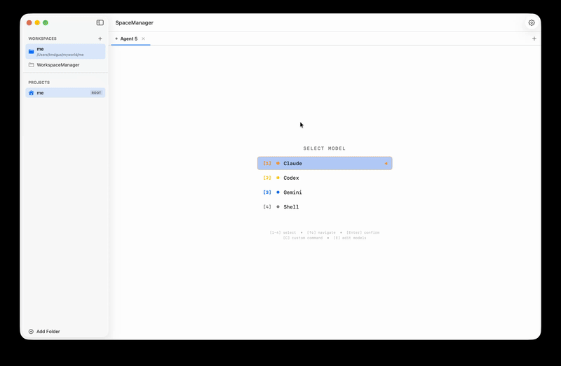

# SpaceManager

A terminal-centric IDE for the age of AI agents.


## Why SpaceManager?

These days, when I do "vibe coding," I hardly look at the code. I'm always just talking to agents after running them in VS Code or a command shell. But VS Code is code-centric, not terminal-centric. Well, I guess that's natural since it's a traditional IDE.

**That's why I created an IDE exclusively for the CLI.**

When you select a project, you won't see a file list - you can only add agents. Run multiple agents, execute them easily with shortcuts, and manage them with ease.

**Happy vibe coding!**

## Features

- **Terminal-First Design**: No file trees, no code editors - just terminals and agents
- **Multi-Agent Support**: Run multiple AI agents side-by-side with auto-splitting panes
- **Persistent Workspaces**: Unlike VS Code or standard shells, your workspace and agents are perfectly preserved when switching between workspaces - and persist completely even after restarting the app
- **Quick Launcher**: TUI-based launcher for AI CLI tools (Claude, Codex, Gemini)
- **Workspace Management**: Organize your projects into workspaces
- **Drag & Drop Tabs**: Reorder agent tabs with smooth animations
- **Session Modes**: Start new sessions or resume previous ones
- **Customizable Models**: Add your own CLI tools and commands

## Demo



## Requirements

- macOS 14.0+
- Xcode 15.0+ (for building)

## Installation

### Build from Source

```bash
git clone https://github.com/NEWBIE0413/SpaceManager.git
cd SpaceManager
swift build -c release
```

### Run

```bash
swift run SpaceManager
```

Or open in Xcode:
```bash
open Package.swift
```

## Usage

### Workspaces
- Click "+" to create a new workspace
- Select a root folder for your workspace
- Add project folders within the workspace

### Agents
- Click "+" in the tab bar to add a new agent
- Use the TUI launcher to select an AI model
- Choose "New Session" or "Resume" mode
- Multiple agents auto-split the terminal pane
- Drag tabs to reorder agents

### Keyboard Shortcuts (in Launcher)
| Key | Action |
|-----|--------|
| `1-9, 0` | Quick select model |
| `N` | New session |
| `R` | Resume session |
| `C` | Custom command |
| `E` | Edit models |
| `ESC` | Go back |

### Settings
- Configure model commands in Settings (gear icon)
- Add custom models with new/resume commands
- Drag to reorder models

## Supported AI CLI Tools

| Model | New Session | Resume |
|-------|-------------|--------|
| Claude | `claude` | `claude --resume` |
| Codex | `codex` | `codex --continue` |
| Gemini | `gemini` | `gemini --resume` |
| Shell | (raw shell) | - |

## Dependencies

- [SwiftTerm](https://github.com/migueldeicaza/SwiftTerm) - Terminal emulation

## Project Structure

```
Sources/SpaceManager/
├── SpaceManagerApp.swift        # App entry point
├── Models/
│   ├── Workspace.swift          # Workspace & Project models
│   ├── CommandPreset.swift      # Model configurations
│   └── AgentSession.swift       # Terminal session management
├── Storage/
│   └── WorkspaceStorage.swift   # JSON persistence
├── ViewModels/
│   └── AppState.swift           # App state management
└── Views/
    ├── ContentView.swift        # Main layout
    ├── Sidebar/                 # Workspace/Project list
    └── TerminalArea/            # Terminal & launcher views
```

## Contributing

This application is still a work in progress. I look forward to your contributions!

Feel free to submit a Pull Request or open an Issue.

## License

MIT License - see [LICENSE](LICENSE) for details.

## Acknowledgments

- [SwiftTerm](https://github.com/migueldeicaza/SwiftTerm) by Miguel de Icaza for the excellent terminal emulation library
