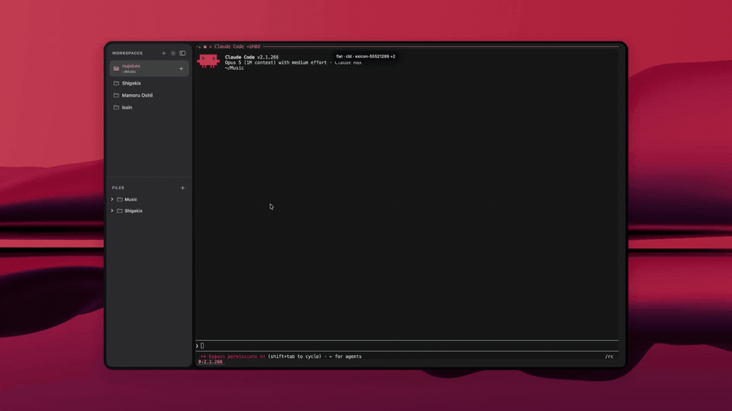

# SpaceManager

[](docs/demo.mp4)

<p align="center"><a href="docs/demo.mp4"><strong>Watch the full demo (MP4)</strong></a></p>

A macOS IDE for tmux-based multi-agent work with the `smux` skill.

## Why I built this

I keep dozens of tmux sessions running and use Claude Code, Codex, and Gemini CLI agents in parallel. The working hierarchy is usually project → tmux session → agent pane.

I built SpaceManager to see that hierarchy in one window. It shows the workspace attached to each session, the panes inside it, and recent agent activity. It is a personal tool for this workflow rather than a general replacement for a code editor or terminal emulator.

## Why it is designed this way

### tmux remains the owner

SpaceManager only attaches to tmux sessions by name. It does not own the tmux server and does not terminate it when the app closes. Session persistence belongs to tmux, with `tmux-resurrect` and `tmux-continuum` handling save and restore.

This boundary was added after real session-loss incidents. App deployment, window restoration, and tmux restoration now remain separate concerns.

### Native window management, web terminal surface

Windows, sidebars, state, and navigation use SwiftUI and AppKit. Only the terminal surface uses `WKWebView` with vendored xterm.js and its WebGL renderer. A small C `forkpty` shim connects xterm.js to local processes.

This keeps macOS window behavior native while retaining terminal behavior required by tmux and CLI TUIs.

Workspace windows extend both panels to the top of a dark canvas, with the activity island floating above them at the center of the whole window. The sidebar button switches between the full sidebar and a compact folder rail while keeping workspace icons at the same vertical positions.

The sidebar and terminal card move together with a fixed gap. The terminal viewport stays at its existing size during the transition and receives the final size once the animation ends, avoiding repeated tmux redraws. Tab switches retain the outgoing surface until the selected terminal has rendered, then fade between them.

### Activity comes from transcripts

The activity dots do not poll agent processes and do not infer activity from terminal repainting. SpaceManager watches Claude, Codex, and Gemini transcripts with FSEvents. Only changed, known transcripts are statted for the generating indicator; a one-shot timer expires that indicator without reopening files. A 30-second reconciliation discovers missed changes and ages out old activity, reusing parsed metadata for unchanged files. Transcript timestamps determine recency, so a batch mtime touch does not make old conversations appear new.

Display scanners pause when every window is covered or minimized, reconcile when a window becomes visible, and stop when their last consumer closes. Quick history loads in batches of 30 as you scroll and reads only appended bytes after indexing a transcript. Open conversations retain title tracking even outside the loaded history page.

### The session-based window does not use tmux

The app includes a session-based quick window for everyday Claude conversations that do not need a project. It starts Claude Code directly in a PTY with `~/cld` as its working directory. Quick tabs are intentionally transient and are not restored after an app restart. Claude Code transcripts remain available for resume.

The session-based window reuses Claude Code's `ai-title` records for tab and window titles. Its recent conversation list reads the same transcripts and resumes a session by ID.

### Model catalogs come from installed CLIs

Claude model IDs are extracted from the installed Claude executable. Codex models and supported reasoning levels come from `~/.codex/models_cache.json`. These CLI-owned catalogs are the normal source of truth, with a small fallback list used only when discovery fails.

An optional local proxy exposes Codex models through the Anthropic Messages interface used by Claude Code. It reuses Codex subscription OAuth from `~/.codex/auth.json`. A proxy-backed session can switch between Claude and Codex with `/model`.

### Glass is limited to the sidebar

The sidebar uses a behind-window `NSVisualEffectView`. The main canvas is opaque. Earlier builds applied behind-window blur and glass effects to more surfaces; measurement with several large windows showed high WindowServer CPU use, so the effect was reduced to the sidebar.

## How to use

### Requirements and current assumptions

- macOS 14 or later
- Swift 5.9 / Xcode 15 or later for building
- `tmux`; `tmux-resurrect` and `tmux-continuum` are recommended for reboot recovery
- Claude Code CLI

Quick conversations run Claude Code, found on your PATH. Their working directory is `~/cld`, which the app creates on first use. A local model router is optional — without it you get the models Claude Code itself offers.

### Build and run

```sh
git clone https://github.com/NEWBIE0413/SpaceManager.git
cd SpaceManager
./scripts/test-isolated.sh
swift build -c release
.build/release/SpaceManager
```

SwiftPM produces the executable and its resource bundle. This repository does not currently include a general-purpose `.app` packaging script.

The test wrapper gives Foundation a temporary home directory because some window-state tests instantiate the application's storage singleton. Scanner benchmarks use synthetic transcripts: `python3 scripts/benchmark-scanners.py`. See [the resource optimization measurements](docs/performance/2026-09-09-scanners.md) for the comparison and its limits.

The development machine uses an existing `/Applications/WorkspaceManager.app` bundle. To refresh that bundle after a release build:

```sh
APP=/Applications/WorkspaceManager.app
cp .build/release/SpaceManager "$APP/Contents/MacOS/SpaceManager"
rm -rf "$APP/Contents/Resources/SpaceManager_SpaceManager.bundle"
cp -R .build/release/SpaceManager_SpaceManager.bundle "$APP/Contents/Resources/"
codesign --force -s - "$APP"
```

Ad-hoc re-signing may require macOS Accessibility and Screen Recording permissions to be checked again.

### Basic workflow

1. Add a project folder from the `WORKSPACES` sidebar.
2. Select it. SpaceManager attaches to the tmux session derived from the workspace name, creating that session only when it does not already exist.
3. Use tmux panes for agents and [`tmux-bridge`](https://github.com/ShawnPana/smux) for cross-pane messages. The CLI is included in the smux repository.
4. Open another workspace window with `Command-N`.
5. Open the session-based window with `Command-Option-N`. Choose a model, effort level, and direct or proxy mode in the composer.
6. Click a recent conversation to resume its transcript-backed session.

| Shortcut | Action |
|---|---|
| `Command-N` | Open a workspace window |
| `Command-Option-N` | Open a session-based window |
| `Command-Shift-N` | Add a workspace |
| `Command-T` | Open a shell tab, or an immediate quick conversation |
| `Command-Shift-T` | Open another tmux tab |
| `Command-Option-Left/Right` | Select the previous or next tab |

When the same tmux session is attached from more than one window, this tmux setting makes the active client determine the session size:

```tmux
set -g window-size latest
```

### Optional Codex router

The router binds to `127.0.0.1:4141` and is not installed as a service. Start it manually:

```sh
cd ~/myworld/claude-codex-router
./scripts/start-background.sh
```

Stop it with:

```sh
./scripts/stop.sh
```

When the router is unavailable, the session-based window keeps the direct Claude model choices and disables proxy-only choices.

## Remote workspaces

A workspace can point its tmux server at another machine. Set an ssh host
alias by clicking the small **computer / server icon** beside a workspace name.
The icon appears only while its row is selected or hovered. Choose **이 Mac**
for native macOS work, **아치 · arch** for the Arch computer, or **다른 SSH 호스트…**
for another configured SSH alias. The same choices are in the context menu under
**실행 위치**. The CLI remains `sm ws remote <ws> <host>`; `none` selects this Mac.

Each workspace keeps its own destination, so local Xcode projects and remote agents
can share the same app window. Changing the destination does not copy project files.
A missing Mac checkout blocks switching to local and leaves the current tabs connected.
Activity dots and island navigation follow both the project path and its host.

The **+ / New Workspace** sheet also offers **이 Mac / 아치 / 다른 호스트** before
creating the first tab. Remote folders can be entered as `~/myworld/project`
without creating a local copy. The equivalent CLI is
`sm ws add ~/myworld/project --name project --host arch` (or `--host local`).

- The tab runs `ssh -t <host>` and attaches to the tmux session of the same
  name on that host, creating it there when it does not exist. The remote
  script uses the same cold-boot patience as local tmux so it never steals a
  session name that `tmux-continuum` is about to restore.
- Paths under the local home are translated to the remote `$HOME`
  (`/Users/me/myworld/x` → `$HOME/myworld/x`), so the same folder layout on
  both machines needs no per-workspace configuration. Paths outside the home
  are sent unchanged.
- Changing the host detaches the workspace's tabs and re-attaches them; tmux
  sessions on either machine are untouched. Extra tabs retain their IDs, order
  and tmux session names.
- Remote workspaces show the host as a small badge in the sidebar and do not
  need a local tmux install.

The ssh alias comes from `~/.ssh/config`; a `ProxyCommand` that picks the
route (VPN or LAN) works transparently, and `ControlMaster` keeps reconnects
cheap.

### Reconnect and Linux session persistence

An interrupted remote tmux connection reconnects after 3 seconds, with failed
attempts backing off to 30 seconds. An explicit tmux detach and transient shell
or Quick tabs remain closed. Selecting a disconnected tab, clicking the badge, or
running `sm tab reconnect <tab>` retries immediately.

While it reconnects, the tab keeps the last frame it received and shows
`연결 재시도 중…` in the terminal's top-right corner until the new connection
draws its first output. Keystrokes are dropped during that time so nothing typed
at the frozen screen reaches tmux after the reconnect. ssh prints "Connection to
… closed by remote host." straight to the terminal whatever its log level, so
remote tmux tabs send ssh's own stderr to a per-tab temporary log; the badge
tooltip shows its last line.

Copying in remote tmux reaches the Mac clipboard through OSC 52 (tmux
`set-clipboard on` or `external`). The terminal accepts clipboard writes and
ignores clipboard read requests.

On a Linux host with `tmux-resurrect` installed under `~/.tmux/plugins`, copy
`scripts/{remote-tmux-persistence.sh,tmux-session-metadata.py,install-remote-tmux-persistence.sh}`
to the same directory and run the installer there. It adds a user timer that
saves every minute, a save before server shutdown, and a restore after server
startup. Saves work without an attached client or a status-right command.
The companion preserves smux labels and keys. The managed startup waits for
restoration before any app tab can create a session with a saved name.

Checkpoints live under `~/.smux/state/persistence`. They preserve window and
pane layouts, working directories and allowlisted Claude/Codex commands; they
do not checkpoint process memory. Resume an agent with an explicit conversation
ID to keep that command restorable. Other processes return to a shell after
reboot. `scripts/sync-remote-tmux-display.py <host>` copies the local smux theme,
navigation keys and pane numbering, retaining Linux clipboard commands and the
native save timer. Both home and XDG tmux configuration entry points are covered.

### Remote activity

Activity dots and the island read local transcripts, so a remote workspace
would otherwise stay dark. `scripts/remote-activity-mirror.sh <host>` closes
that gap without copying transcripts: every five seconds it runs
`scripts/remote-activity-summary.py` on the host over ssh (sent on stdin, so
nothing is installed there) and stores the result, a few kilobytes of
per-transcript cwd, last-event time, and last user message, in
`~/.space-manager/remote/<host>/activity.json`. The app watches that folder,
maps remote-home paths back to the local home, and tags the sessions with the
host. The generating indicator uses the remote mtimes with clock skew
corrected from the summary's own timestamp, and stops after 30 seconds without
a fresh summary. Install it as a launchd agent with
`scripts/install-remote-mirror.sh <host>` (`--uninstall` removes it). The
mirror only pulls; the remote machine never needs to reach the Mac.

## sm CLI

Everything the app can do is also available from the terminal. The app opens a
line-delimited JSON control socket at `~/.space-manager/control.sock`, and
`sm` (`swift build -c release` → `.build/release/sm`, installed as `~/bin/sm`)
sends one request per connection. When the app is not running, `sm` launches
it and waits for the socket.

```text
sm windows                          창 목록
sm window new [--quick]             새 창 (워크스페이스/Quick)
sm window focus|close <win>         창 앞으로/닫기
sm window appearance <win> <light|dark|system>

sm ws [list]                        워크스페이스 목록 (모든 창)
sm ws add <path> [--name N]         워크스페이스 추가
sm ws select|delete <ws>            선택(창 앞으로)/삭제
sm ws rename <ws> <name>            이름 변경 (빈 문자열이면 폴더명)
sm ws tmux-name <ws> <name>         tmux 세션명
sm ws remote <ws> <host|none>       원격 호스트 (ssh 별칭) — tmux를 그 머신에서
sm ws move <ws> <index>             순서 이동
sm project add|remove <ws> <path>   추가 프로젝트 폴더

sm tabs [ws]                        탭 목록
sm tab shell|tmux [ws]              탭 추가
sm tab select|close <tab>           탭 선택/닫기
sm tab reconnect <tab>              끊어진 연결 재시도 (실행 중 세션 유지)
sm tab next|prev

sm quick [list] [-n N]              최근 Claude 대화
sm quick new [--model M] [--effort E] [--proxy] [prompt…]
sm quick resume <session-id>
sm quick home

sm activity                         에이전트 활동 (transcript 기반)
sm state                            window-states.json 덤프
sm ping
```

Options: `--json` prints the raw response, `-w/--window <id|index|front>`
picks the window, `--no-focus` leaves the app in the background. `<ws>` is a
name, tmux session name, path, or id prefix; `<tab>` is a name, index, or id
prefix; `<win>` is an index, id prefix, or `front`.

The protocol is `{"command":"ws.select","args":{"ws":"flat"}}\n` →
`{"ok":true,"result":{…}}\n` or `{"ok":false,"error":"…"}\n`. The app-side
router lives in `Sources/SpaceManager/Control/`; a new UI feature gets its
command in the same commit.

## Credits

- Demo recorded with [OpenScreen](https://github.com/siddharthvaddem/openscreen).
- Agent orchestration uses the [smux](https://github.com/ShawnPana/smux) skill by [ShawnPana](https://github.com/ShawnPana). The development of SpaceManager itself was coordinated through this protocol.
- Terminal rendering uses [xterm.js](https://github.com/xtermjs/xterm.js).
- Session management and recovery use [tmux](https://github.com/tmux/tmux), [tmux-resurrect](https://github.com/tmux-plugins/tmux-resurrect), and [tmux-continuum](https://github.com/tmux-plugins/tmux-continuum).

SpaceManager is released under the [MIT License](LICENSE).
